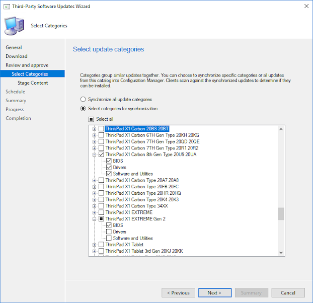
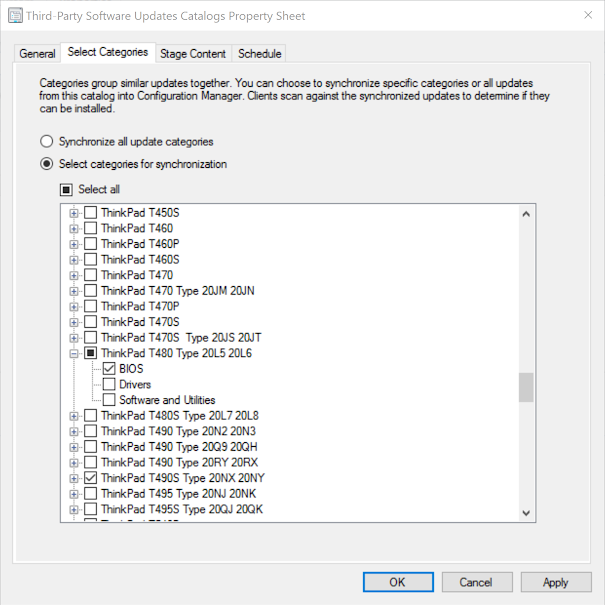
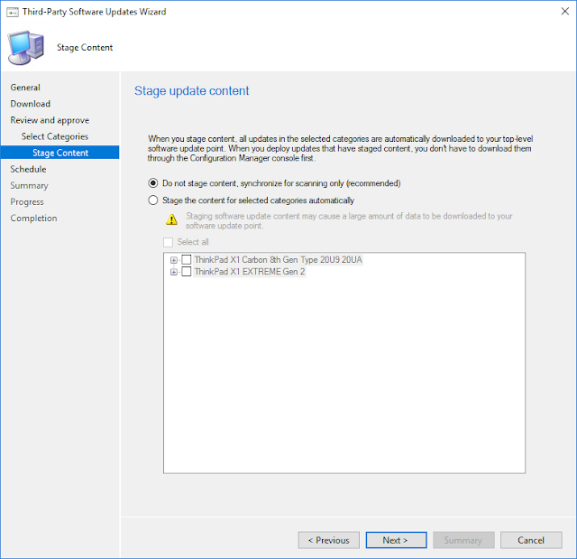

---
date:
    created: 2020-06-16
authors:
    - Joe
    - Devin
categories:
    - "2020"
title: Lenovo Updates Catalog v3 for SCCM
---

The Lenovo Updates Catalog has been upgraded to the V3 format.  The catalog is still hosted at the same URL:

<https://download.lenovo.com/luc/v2/LenovoUpdatesCatalog2v2.cab>

The URL and file name did not change so as to avoid all subscribers having to change their subscription settings.  The V3 format simply adds some additional files that allow the updates in the catalog to be categorized.
<!-- more -->
Previously when subscribing to the V2 catalog, all the updates in the catalog would automatically be published with meta data only.  Now with the V3 catalog, you can specify one or more categories to automatically publish instead of publishing all updates.  The categories in the Lenovo Updates Catalog are broken down into Model and Update Type (BIOS, driver, application).

The categories can be selected when initially syncing the catalog or right-clicking on the catalog and selecting properties.

Once categories are selected, the content can be staged which means it will be automatically downloaded to the top-level Software Update Point. This will remove the need to download the content through the Configuration Manager console prior to deployment.

### Summary

With the introduction of the V3 format, you now have more granular control over what content from the catalog is published into your environment. With thousands of updates in a third-party catalog, this can make a big difference in the amount of data managed in your environment as well as the amount of processing your clients perform during their scan cycles.

### More Information

<https://docs.microsoft.com/en-us/mem/configmgr/sum/deploy-use/third-party-software-updates>
