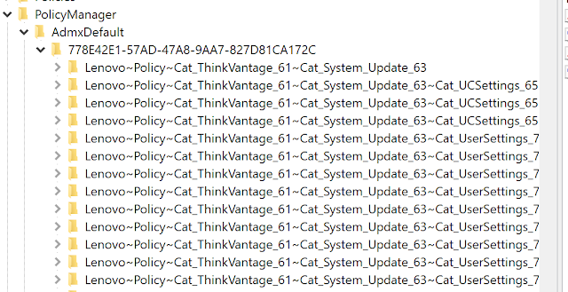
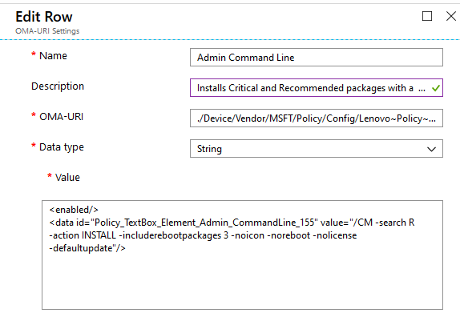
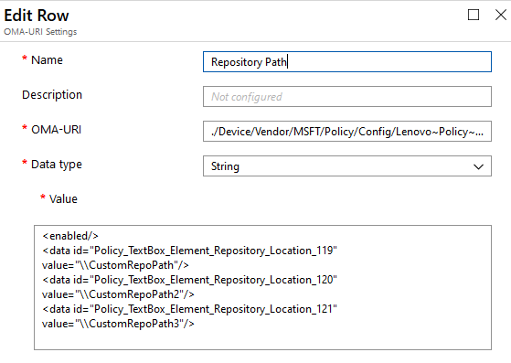
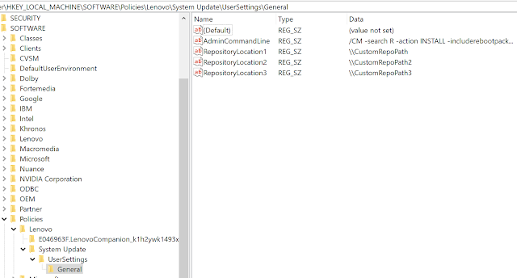

---
date:
    created: 2020-03-12
authors:
    - Phil
categories:
    - "2020"
title: Managing System Update with Intune
---


This post will describe how you can manage Lenovo System Update on Windows 10/11 devices with Intune.
<!-- more -->
Before you begin, you will need:

- [System Update Administrator Tools](https://download.lenovo.com/pccbbs/thinkvantage_en/zb59_tvsu_win7_win8_admin59.exe) - This contains the System Update ADMX/ADML files. By default, the contents are extracted to C:\SWTOOLS\TOOLS\Admin
- A Windows 10 or 11 device connected to Azure Active Directory and managed by Intune
- [System Update](https://support.lenovo.com/us/en/solutions/ht037099) installed on the device

## Ingest the TVSU ADMX file

Sign in to the Microsoft Endpoint Manager [admin center](https://endpoint.microsoft.com)

- Navigate to **Devices > Windows > Configuration Profiles > Create Profile**
- Select **Windows 10 and later** for Platform
- Select **Templates** for Profile type and choose the **Custom** template. Click **Create**
- Enter a name for the profile, for example, **Lenovo System Update configuration**
- Enter a description (Optional)

In the Custom OMA-URI Settings menu, click Add and enter the following

- **Name**: TVSU ADMX Ingest
- **Description**: (Optional)
- **OMA-URI**:

```text
./Device/Vendor/MSFT/Policy/ConfigOperations/ADMXInstall/Lenovo/Policy/TVSU
```

- **Data Type**: String
- **Value**: Copy the contents of the tvsu.admx into this field

Click **save** to complete adding the new OMA-URI row.

Assign the profile to a group. This group should only include devices that have System Update installed.

Verify the settings have pushed to a device by launching Regedit and navigating to **HKLM\SOFTWARE\Microsoft\PolicyManager\AdmxDefault**



## Creating a TVSU Policy

### Example 1

Repeat the steps above by adding an additional configuration setting. This example will be for setting the **AdminCommandLine**

- **Name**: Admin Command Line
- **Description**: Installs Critical and Recommended packages with a reboot type 3 (requires reboot)
- **OMA-URI**:

```text
./Device/Vendor/MSFT/Policy/Config/Lenovo~Policy~Cat_ThinkVantage_61~Cat_System_Update_63~Cat_UserSettings_74~Cat_General_78/Policy_Admin_CommandLine_154
```

- **Data Type**: String
- **Value**

```XML
<enabled/>
<data id="Policy_TextBox_Element_Admin_CommandLine_155" value="/CM -search R -action INSTALL -includerebootpackages 3 -noicon -noreboot -nolicense"/>
```



### Example 2

This example will set custom repository paths

- **Name**: Repository Path
- **Description**: Optional
- **OMA-URI**:

```text
./Device/Vendor/MSFT/Policy/Config/Lenovo~Policy~Cat_ThinkVantage_61~Cat_System_Update_63~Cat_UserSettings_74~Cat_General_78/Policy_Repository_Location_116
```

- **Data Type**: String

- **Value**

```XML
<enabled/>
<data id="Policy_TextBox_Element_Repository_Location_119" value="\\CustomRepoPath"/>
<data id="Policy_TextBox_Element_Repository_Location_120" value="\\CustomRepoPath2"/>
<data id="Policy_TextBox_Element_Repository_Location_121" value="\\CustomRepoPath3"/>
```



Verify the policies have pushed down to the device by launching Regedit and navigating to **HKLM\SOFTWARE\Policies\Lenovo\System Update\UserSettings\General**



#### Further Reading

[Enable ADMX-backed policies in MDM](https://docs.microsoft.com/windows/client-management/mdm/enable-admx-backed-policies-in-mdm)

[Win32 and Desktop Bridge app policy](https://docs.microsoft.com/windows/client-management/mdm/win32-and-centennial-app-policy-configuration)
