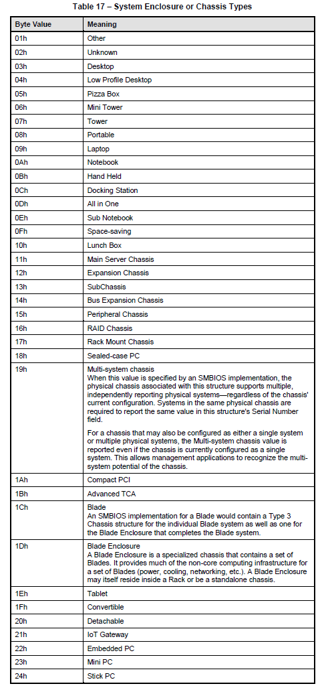

---
date:
    created: 2018-11-26
authors:
    - Thad
categories:
    - "2018"
title: "MDT No Longer Detects Enclosure Correctly"
---

The SMBIOS Specification was updated again this year to add new enclosure type values that affect the IsDesktop, IsLaptop, and IsServer variables in MDT.  These variables are populated by ZTIGather.wsf.  To ensure your IsDesktop, IsLaptop, IsServer variables are accurate you should upgrade your MDT environment to [version 8456](https://www.microsoft.com/download/details.aspx?id=54259).<!-- more -->  If, for some reason, you cannot or should not update your MDT version, you can also easily update the ZTIGather.wsf script.

!!! Warning "Backup Script"
    Please make a backup copy of ZTIGather.wsf prior to editing.

Find the following lines of code:

```VBScript
    Select Case objInstance.ChassisTypes(0)
        Case "8", "9", "10", "11", "12", "14", "18", "21"
                bIsLaptop = true
        Case "3", "4", "5", "6", "7", "15", "16"
                bIsDesktop = true
        Case "23"
                bIsServer = true
        Case Else
                ' Do nothing
    End Select
```

Replace the lines with:

```VBScript
    Select Case objInstance.ChassisTypes(0)
        Case "8", "9", "10", "11", "12", "14", "18", "21", "30", "31", "32"
                bIsLaptop = true
        Case "3", "4", "5", "6", "7", "13", "15", "16", "35", "36"
                bIsDesktop = true
        Case "23", "28"
                bIsServer = true
        Case Else
                ' Do nothing
    End Select
```

The table from the current (as of the date of this writing) [SMBIOS specification](https://www.dmtf.org/sites/default/files/standards/documents/DSP0134_3.2.0.pdf) for your reference:

