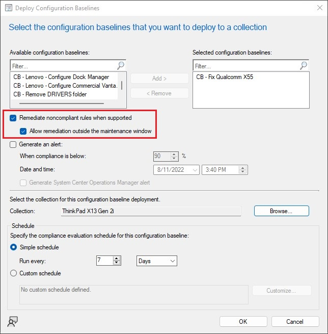

---
date:
    created: 2022-08-10
authors:
    - Phil
categories:
    - "2022"
title: Correcting the Qualcomm X55 WWAN Excessive Logging Issue
---

## Symptoms

Continuously growing log files generated by the Qualcomm X55 WWAN service. These logs are located under **%ProgramData%\Qualcomm® Snapdragon™ X55 5G Modem\SVClog**
<!-- more -->
### Scenario

Installing the SCCM driver pack with ConfigMgr or MDT on systems that did *not* have the card installed would result in excessive logging issues.

If the driver were to be upgraded by either System Update/Thin Installer/Commercial Vantage/Lenovo Patch, it would no longer be an issue. Systems that were upgraded were where the WWAN card was detected as installed. In this case, later versions of the driver would fix those systems.

On systems that do **NOT** have the card installed, the above mentioned tools would never see the device and never update the driver.

### Known Affected Models

- **ThinkPad X1 Carbon Gen 9/10**
- **ThinkPad X1 Yoga Gen 6/7**
- **ThinkPad T14 Gen 2**
- **ThinkPad X13 Gen 2**
- **ThinkPad X1 Nano Gen 1**

## Solution

One possible solution is to leverage a ConfigMgr Configuration Item/Baseline. The CI will include two script setting types consisting of detection/remediation scripts. These scripts will:

- Check if the logs are present and delete them if the WWAN card is not installed (detected by PnpId)
- Check if the Qualcomm Sim Service is running and to stop/disable the service

[**Download the Configuration Baseline here**](https://download.lenovo.com/cdrt/blog/CI_CB-FixQualcommSnapdragonX55.zip)

### Script Type Settings

**Name** - Detect Qualcomm WWAN Log

Discovery Script

```powershell
$QCD = Get-PnpDevice -InstanceID "USB\VID_0489&PID_E0B1&MI_02*"

If ($Null -eq $QCD){ 
    $Path = Join-Path -Path ($env:ProgramData) -ChildPath "Qualcomm® Snapdragon™ X55 5G Modem"
    if (Test-Path -Path $Path) {
        if (Get-ChildItem -Path $Path -Filter "log*.txt" -Recurse) {
            return $true
        }
    }
    else {
        return $false
    }
}
else{
    return $false
}
```

Remediation Script

```powershell
$Path = Join-Path -Path ($env:ProgramData) -ChildPath "Qualcomm® Snapdragon™ X55 5G Modem"
Get-ChildItem -Path $Path -Filter "log*.txt" -Recurse | Remove-Item -Force
```

**Name** - Detect SimService Status

Discovery Script

```powershell
If ((Get-Service -Name SimService).Status -eq "Running") { 
    return $true 
}
Else { 
    return $false 
}
```

Remediation Script

```powershell
$Service = Get-Service -Name SimService
Stop-Service -Name $Service.Name
Set-Service -Name $Service.Name -StartupType Disabled
```

### Deploying the Baseline

When you're ready to deploy the baseline, be sure to tick the box to remediate noncompliant rules when supported.



### Monitoring

In the console, navigate to the **Monitoring** workspace and select the **Deployments** node. Here, you can review the deployment status of the baseline.
