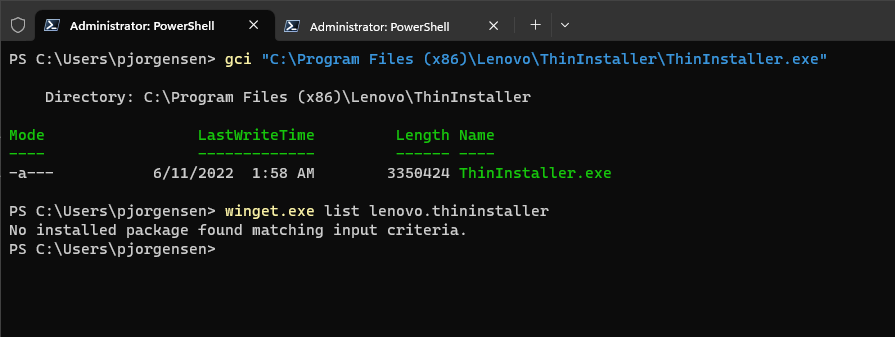
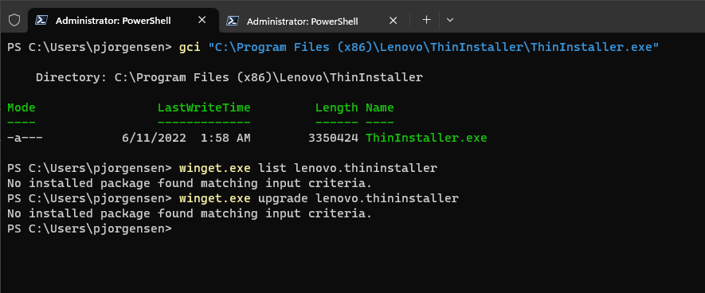
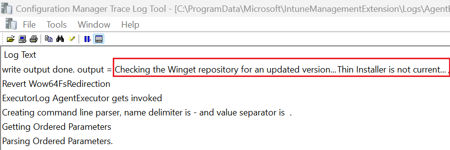
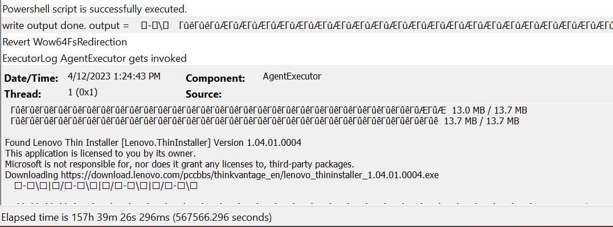
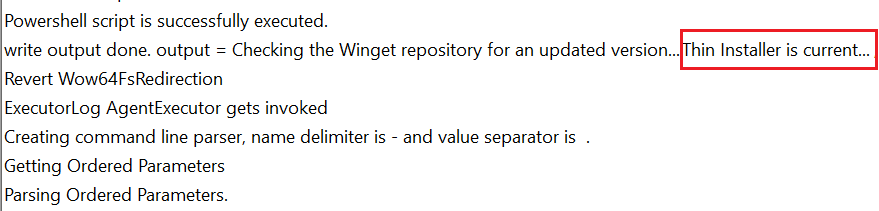
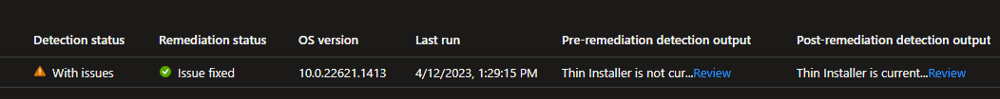

If your endpoints rely on Thin Installer to update drivers/BIOS/firmware, it should always be on the latest release. As part of the certificate verification process for installing updates with Thin Installer, older versions of Thin Installer cannot validate packages signed with newer certificates. The only solution is to upgrade Thin Installer, hence the reason for this article.
<!-- more -->
Lenovo's enterprise tools are now available in the Windows Package Manager Community [Repository](https://github.com/microsoft/winget-pkgs) and can be managed using the [Winget tool](https://learn.microsoft.com/windows/package-manager/winget/).

Since Thin Installer doesn't require installation, a Registry detection as to which version is "installed" on the endpoint isn't an option. What you're left with comes down to a file version check on the Thin Installer application itself.

While it's available to install from the winget repository, the manifest does not include uninstall parameters. And as it's not actually "installed" on the endpoint, winget doesn't recognize it either.

On my test machine, I installed an older version of Thin Installer via winget. Executing a simple get-childitem command verifies this, however, the **list** command of the winget tool says otherwise



What about the **upgrade** command of winget?



Nope. Can't upgrade if it's not there. So how can this tool be kept current without having to create a separate Win32 App?

## Solution

We'll use a Proactive Remediation script package to compare the version of Thin Installer on the endpoint and what's available in the winget repository.

While the winget tool will be used to perform the upgrade, I found the [**PSWinget** Module](https://www.powershellgallery.com/packages/PSWinGet/1.0.0.4) handles the version comparisons much easier than manipulating the output from the winget tool itself. For my testing and expected end results, this is what I stuck with. The detection/remediation scripts can be found on my [GitHub](https://github.com/philjorgensen/Intune/tree/main/Proactive%20Remediations/Apps).

!!! info ""
    This solution will install a PowerShell module on the endpoint

Detection script

```powershell
# Enable Tls 1.2 support to download modules
[Net.ServicePointManager]::SecurityProtocol = [Net.ServicePointManager]::SecurityProtocol -bor [Net.SecurityProtocolType]::Tls12

if (-not(Get-InstalledModule -Name PSWinGet -ErrorAction SilentlyContinue)) {
    Write-Output -InputObject "`nPSWinGet module was not found. Installing ..."
    try {
        # Install NuGet package provider
        Install-PackageProvider -Name "NuGet" -MinimumVersion 2.8.5.201 -Force -ErrorAction Stop
        # Install PSWinGet module for easier app version comparisons
        Install-Module PSWinGet -Scope AllUsers -Force -Confirm:$false
    }
    catch {
        Write-Error -Message $_.Exception.Message
    }
}

$ThinInstallerPath = Join-Path -Path (Join-Path -Path ${env:ProgramFiles(x86)} -ChildPath Lenovo) -ChildPath "ThinInstaller"
if (-not(Test-Path -Path $ThinInstallerPath)) {
    Write-Output -InputObject "Thin Installer not present..."; Exit 1
} else {
    Write-Output -InputObject "Checking the Winget repository for an updated version..."
}

[version]$LocalVersion = $(try { ((Get-ChildItem -Path $ThinInstallerPath -Filter "thininstaller.exe" -Recurse).VersionInfo.FileVersion) } catch { $null })
[version]$WingetVersion = (Find-WinGetPackage -Id Lenovo.ThinInstaller).Version
if ($LocalVersion -lt $WingetVersion) {
    Write-Output -InputObject "Thin Installer is not current..."; Exit 1
}
else {
    Write-Output -InputObject "Thin Installer is current..."; Exit 0
}
```

Simple Remediate script

```powershell
try {
    Install-WinGetPackage -Id Lenovo.ThinInstaller -Confirm:$false; Exit 0
}
catch {
    Write-Warning -Message $_.Exception.Message; Exit 1
}
```

## Monitoring

Tracking the **AgentExecutor.log** on my test system with an older version of Thin Installer, I see the version is not current.



Remediation kicks in and downloads the current version.



Detection reevaluates and shows it's now current.



Checking back in the Intune console, I can see issues were fixed and all is well.


